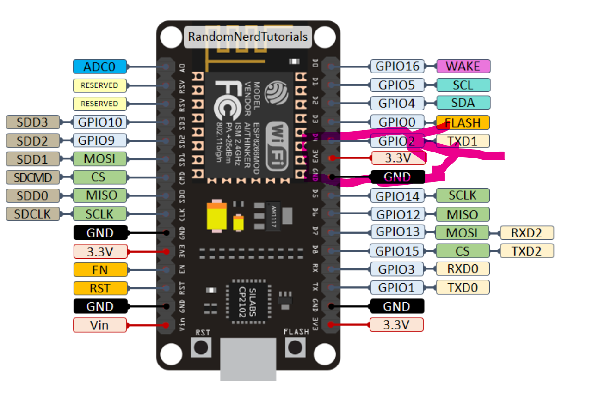

# 리붓하는 기계만들기
##  servo motor
- SG90사용

- 오랜지색이 신호선입니다.
- 기본 구동 예제코드
	```py
	#test.py
	import machine
	p4 = machine.Pin(4)
	servo = machine.PWM(p4,freq=50)
	# duty for servo is between 40 - 115
	servo.duty(100)
	```
## nodemcu 8266

- gnd, 3.3v 결선하고, d4인, GPIO2 사용합니다.
	- 즉, 즉 위에 코드 2번줄에서
		- p4 = machine.Pin(2)로 수정합니다.

## tera term
- 연결을 테스트하기 위함, 아래의 adafuit-ampy를 사용할 경우에는 이용 필요없습니다.
	- speed를 115200으로 맞추는것이 중요합니다.


## vscode
1. pip 패키지
	- adafruit-ampy
		- adafruit-ampy==1.1.0
2. 실행 코드
	- ``` ampy.exe --port COM3 run .\servo.py```
	- --port COM3은 실제 연결되는 포트 확인해서 사용합니다.
	- run .\servo.py는 실행 코드
	```py
	#servo.py
	import machine
	import time

	p2 = machine.Pin(2)
	servo = machine.PWM(p2,freq=50)
	def toggle(steps):
		
		servo.duty(130)
		step = int(100/steps)
		for i in range(1,steps+1):
			# duty for servo is between 30 - 130
			servo.duty(130-(step*i))
			time.sleep(0.01)
		time.sleep(0.5)
		servo.duty(130)
		
	# time.sleep(5)
	toggle(100)
	time.sleep(5)
			
	machine.reset()
	```